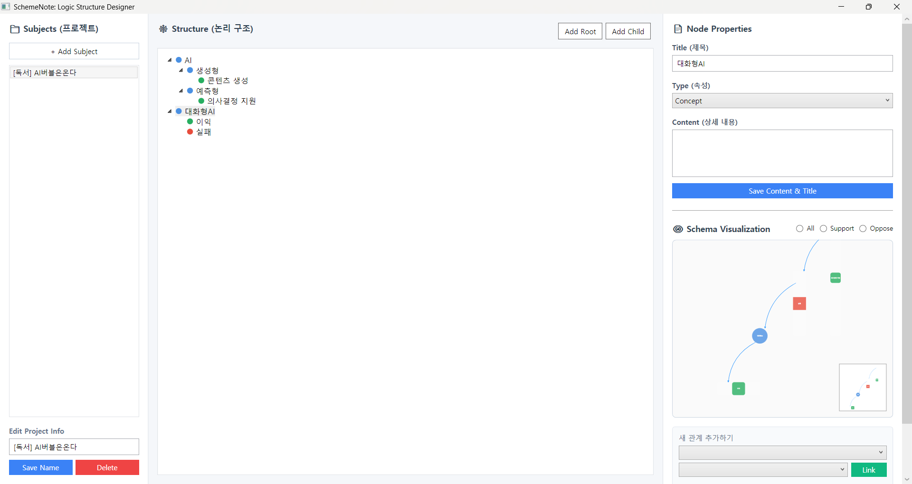

# SchemeNote: Logic Structure Designer

> **"복잡한 생각의 파편들을 하나의 논리적 지도로 연결합니다."**

단순한 메모장만으로는 부족할 때가 있습니다. 생각과 생각 사이의 '관계'가 중요하고, 그 논리적 흐름을 시각적으로 파악해야 할 때 **SchemeNote**는 강력한 도구가 됩니다.

프로젝트의 구조를 트리 형태로 설계하고, 각 요소 간의 지지(Support)나 반대(Oppose)와 같은 복잡한 스키마 관계를 동적인 그래프로 시각화하기 위해 개발되었습니다.

---

### 💡 탄생 배경 (Why?)

우리는 정보를 계층적(Tree)으로 정리하기도 하지만, 실제 논리는 계층을 넘어 거미줄처럼 얽혀 있습니다.

* "A라는 주장에 대한 근거는 B지만, C와는 대립한다."
* "이 프로젝트의 핵심 개념은 X지만, 실제 구현은 Y와 Z로 나뉜다."

이런 복잡한 관계를 한눈에 보고 싶다는 갈증에서 시작되었습니다. 트리 구조에 동적 그래프를 결합하여, 생각의 연결 고리를 더 입체적으로 관리할 수 있도록 만들었습니다.

---

### 주요 기능 (Key Features)

#### 1. 유연한 노드 트리 관리

* **계층적 구조**: 프로젝트(Subject) 하위에 무한한 깊이의 노드를 생성할 수 있습니다.
* **직관적인 드래그 앤 드롭**: 트리뷰에서 노드를 끌어다 놓는 것만으로 구조를 재배치합니다.
* **우클릭 컨텍스트 메뉴**: 마우스 오른쪽 버튼 하나로 자식 노드 추가, 삭제 등 모든 편집이 가능합니다.

#### 2. 스키마 시각화 (Schema Visualization)

* **실시간 관계 도식**: 노드 간의 보충, 근거, 반대 관계를 베지어 곡선과 화살표로 시각화합니다.
* **인터랙티브 캔버스**: 마우스 휠로 줌인/줌아웃하고, 노드를 직접 드래그하여 배치할 수 있습니다.
* **미니맵 지원**: 구조가 거대해져도 우측 하단 미니맵을 통해 현재 위치를 놓치지 않습니다.

#### 3. 상세 속성 편집

* **노드 타입 지정**: 개념(Concept), 주장(Claim), 근거(Evidence) 등 성격에 맞는 타입을 지정하고 그에 맞는 색상과 모양으로 구분합니다.

---

### 🛠 기술 스택 (Tech Stack)

* **Language**: C# 12.0
* **Framework**: .NET 8 / WPF (Windows Presentation Foundation)
* **Architecture**: MVVM 패턴 (CommunityToolkit.Mvvm 사용)
* **Database**: SQLite & Entity Framework Core (로컬 저장소)
